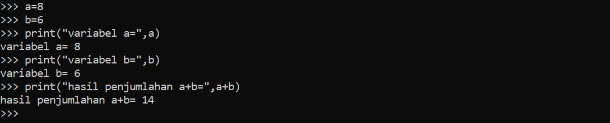
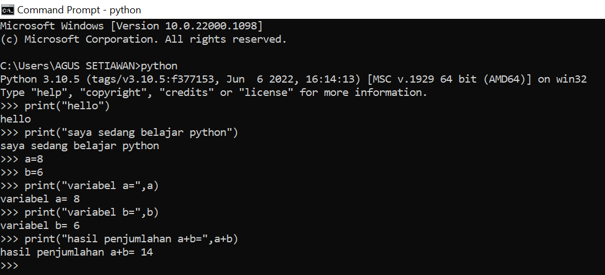

# Latihan 1
- Menjalankan **python console**
- Menampilkan tulisan **"hello"** dilayar
- Menampilkan tulisan **"saya sedang belajar python"** dilayar

# Latihan 2
- menjumlahkan dua buah bilangan menggunakan variable a dan b
- mendefisinikan variable a dengan nilai 8
- mendefisinikan variable b dengan nilai 6
- mencetak nilai varible a dan b
- mencetak hasil penjumlahan a dan b

# Latihan 2

# Latihan 3
- 
