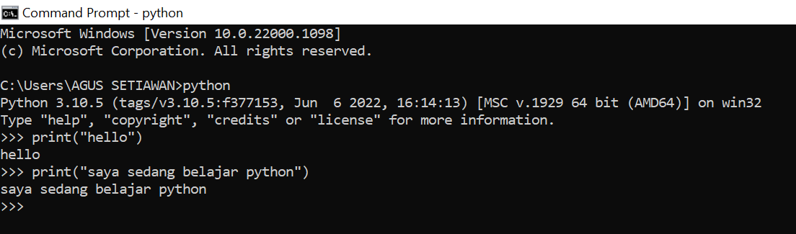

# Latihan 1
- Menjalankan **python console**
- Menampilkan tulisan **"hello"** dilayar
- Menampilkan tulisan **"saya sedang belajar python"** dilayar

# Latihan 2
- menjumlahkan dua buah bilangan menggunakan variable a dan b
- mendefisinikan variable a dengan nilai 8
- mendefisinikan variable b dengan nilai 6
- mencetak nilai varible a dan b
- mencetak hasil penjumlahan a dan b

 

# Latihan 2

# Latihan 3

- Menjalankan **IDLE**
- Membuat file baru dengan nama **Latihan3.py** (pastikan lokasi file pada folder **lab2.py** pada dierktory kerja anda)
- Menggunakan fungsi **input** untuk mengambil nilai variable dari keybord
